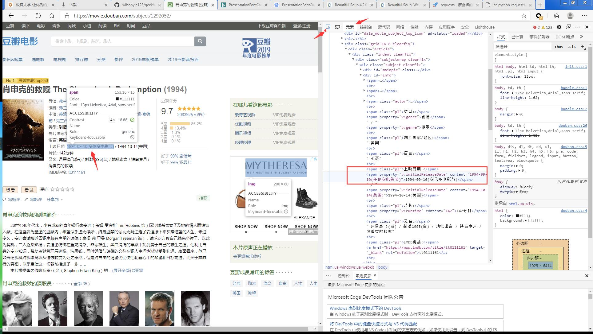
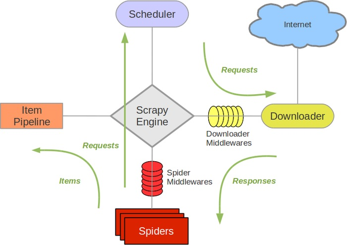

# python爬虫

## requests
### requests 文档
``` import requests ```
[Requests: 让 HTTP 服务人类](https://cn.python-requests.org/zh_CN/latest/)


requests 设置header
```
def requests_test1():
    user_agent = "Mozilla/5.0 (Windows NT 6.1; Win64; x64) AppleWebKit/537.36 (KHTML, like Gecko) Chrome/83.0.4103.116 Safari/537.36 Edg/83.0.478.64"

    h = {'user-agent': user_agent}

    target_url = "https://movie.douban.com/top250"
    
    response = requests.get(target_url, headers=h)

    print (response.text)
    print (response.status_code)
```
不设置headers, 此请求返回418

### requests与urllib对比

``` from urllib import request ```
urllib是一个库，包含很多包，也可以使用
```
import urllib.request
```
urllib使用起来不如requests方便。

```
# urllib 例子

```

## BeautifulSoup

```
from bs4 import BeautifulSoup as bs
```

[Beautiful Soup 4.2.0 文档](https://www.crummy.com/software/BeautifulSoup/bs4/doc/index.zh.html)

参数：
```
def __init__(self, markup="", features=None, builder=None,
                 parse_only=None, from_encoding=None, exclude_encodings=None,
                 element_classes=None, **kwargs):
```
主要的解析器有4种， 


## XPath使用
### 浏览器操作
进入[豆瓣-肖生克的救赎](https://movie.douban.com/subject/1292052/)
打开浏览器调试界面，选择“元素”标签。
然后点击我们要关注的信息，比如“上映日期”1994-09-10。此时右侧出现对应的html代码。

如果我们使用BeautifulSoup查找，要找到span标签，content。
我们在代码侧，鼠标右键---复制---复制Xpath。
使用Xpath也可以匹配到span标签。 win+f打开搜索栏，输入拷贝的XPath，此时对应的标签会高亮显示。（没成功，再试一下）。

### 在python中使用XPath
首先要导入lxml.etree
使用lxml.etree.HTML()来处理html页面内容。
使用 lxml.etree.HTML().xpath()来选择对应的内容。
```
import lxml.etree
def xpath_test():
    text = requests_test("https://movie.douban.com/subject/1292052/")
    selector = lxml.etree.HTML(text)

    film_name = selector.xpath('//*[@id="content"]/h1/span[1]/text()')
    print("film name is %s" % (film_name))
    
    actor = selector.xpath('//*[@id="info"]/span[3]/text()')
    print("actors: %s" % actor)
    
    summary = selector.xpath('//*[@id="link-report"]/span[1]/span/text()')
    print ("summary: %s" % summary)
```
xpath传参时，从浏览器中复制出的xpath+text()方法。意思是取标签的内容。

### 使用pandas保存数据
导入pandas库
使用DataFrame方法
使用to_csv()方法保存成csv文件
```
import pandas as pd
def pandas_test():
    d = xpath_test()
    movie_info = pd.DataFrame(data=d)
    movie_info.to_csv("./movie.csv", encoding='gbk',
                      index=False, header=False)
```
### 翻页功能

```
def page_turn():
    urls = tuple(f"https://movie.douban.com/top250?start={ page * 25 }&filter=" for page in range(0, 10))
    print (urls)

    for url in urls:
        print (url)
        text = requests_test(url)
        selector = lxml.etree.HTML(text)
        name = selector.xpath(
            '//*[@id="content"]/div/div[1]/ol/li[2]/div/div[2]/div[1]/a/span[1]/text()')
        print (name)
```

## Python 基础语法
[Python 数据结构](https://docs.python.org/zh-cn/3/tutorial/datastructures.html)
[Pyhton 其他流程控制工具](https://docs.python.org/zh-cn/3/tutorial/controlflow.html)
[Pyhton 中的类](https://docs.python.org/zh-cn/3/tutorial/classes.html)
[Python 定义函数](https://docs.python.org/zh-cn/3/tutorial/controlflow.html#defining-functions)

## 前端基础知识
W3C标准

结构，表现，行为
html, css, js


## scrapy
### scrapy特点
集成了很多功能，

### 核心组件
引擎：数据的下载、处理，都会流经引擎。高效处理爬取的数据。
调度器：对请求排序，结果去重，
下载器：相比requests更加强大的下载工具
爬虫：从特定的网页中提取需要的信息。类似BeautifulSoup等
项目管道：通过管道将数据存入指定的介质中。

### scrapy工作流程


引擎是爬虫最开始运行的部分。引擎首先通过自己的配置，找到要去什么域名去爬取数据。引擎根据域名，去找到对应的爬虫组件，一个Scrapy可以配置多个Spider组件。<br/>
spider组件对要爬取的url发起请求，请求会进入调度器。根据传入的请求的先后顺序放到调度器中。此时，会先做一次去重。然后调度器根据请求顺序再发给引擎，引擎再去找到Downloader，发起真正的请求。返回的信息会再次传入给引擎。
再请求发给下载器和下载器将结果返回给引擎时，都会经过Downloader Middlewares。下载中间件就可以在发起下载和下载结束后做一个中间处理，比如过滤，增加删减内容等。<br/>
当返回结果达到引擎后，引擎会将结果返回给Spider，此时可以通过Spider Middlewares做进一步处理。
Spider对结果的处理，有两个方向，一个时Item Pipeline, 一个是Scheduler。如果爬取结束，就通过Item Pipeline交给Item 进行数据保存。如果要对返回结果再次进行爬取，就将结果再次发给引擎，在给调度器。。。

一般使用scrapy,只需要修改爬虫器和管道即可。

### Scrapy使用
