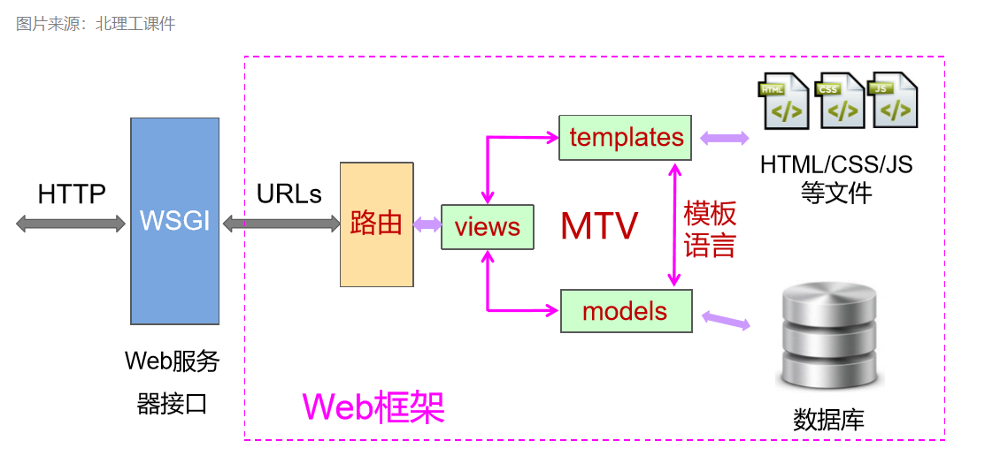

# Python-6 Django

## Web 框架
### 常见的 web 框架：
* web.py
* Django
* tronado
* FALSK
* AIOHTTP
* FASTcgi

这些都遵循 MVC 设计模式，

### Django 框架简介
开源
### MTV框架


浏览器发送请求
Views 视图层接收请求
Views 视图层调用models
Models 模型层创建模型
Models 模型层实行CURD（获取数据）
Views 视图层调用模板
Trmplates 
Views 视图层将数据填充到模板上再响应客户端

### Django 的特点
采用了MTV框架
强调快速开发和代码复用，DRY (Do Not Repeat Youself)
组件丰富：
ORM(对象关系映射)映射类来构建数据模型
URL支持正则表达式
模板可继承
内置用户认证，提供用户认证和权限功能
admin 管理系统
内置表单模型、Cache缓存系统、国际化系统等


## Getting Start

### 安装
建议使用2.2版本

pip install django==2.2.13

### 创建项目
启动Django 主要分三个步骤：
* 创建Django项目
* 创建应用程序
* 启动

#### 创建Django项目
使用 django-admin 命令
$ django-admin startproject MyDjango
之后会创建如下目录结构：
```
E:\LINUX\NOTE\PYTHON\PYTHON-6\DJANGO_TEST
└─MyDjango
    ├─manage.py
    └─MyDjango
        ├─__init__.py
        ├─settings.py
        ├─urls.py
        └─wsgi.py
```
其中， manage.py 是命令行工具，来对项目进行管理和操作。 通过 python manage.py help 可查看支持的操作。
settings.py是项目配置文件。

#### 创建 Django 应用程序
创建好项目后，相当于有了一个框架。但真正运行的是应用程序。  
$python manage.py startapp index
创建名为index的app。之后会创建一系列的文件和目录， 其中 models.py 就是模型， views.py是视图相关内容，admin.py 用于管理后台， tests.py 进行自动化测试，migrations 是数据库迁移文件夹。
```
E:\LINUX\NOTE\PYTHON\PYTHON-6\DJANGO_TEST\MYDJANGO\INDEX
├─__init__.py
├─admin.py
├─apps.py
├─models.py
├─tests.py
├─views.py
└─migrations
    └─__init__.py
```
此时，该项目已经可以运行，显示Django的欢迎界面。
python manage.py runserver
访问 http://127.0.0.1:8000/ 即可。默认开启DEBUG。
如果需要修改端口或者服务IP， 加参数：
$ python manage.py runserver 0.0.0.0:9000

## settings.py 配置文件
配置文件包括：
* 项目路径
* 密钥
* 域名访问权限
* APP列表 (INSTALLED_APPS)
* 静态资源、包括CSS,JavaScript 图片等
* 模板文件
* 数据库配置
* 缓存
* 中间件

大部分不需要修改。  
[For more information on this file](https://docs.djangoproject.com/en/2.2/topics/settings/)  
[For the full list of settings and their values](https://docs.djangoproject.com/en/2.2/ref/settings/)

debug 模式只能服务一个连接？

app 列表
```
INSTALLED_APPS = [
    # 内置的后台管理系统
    'django.contrib.admin',
    # 内置的用户认证系统
    'django.contrib.auth',
    # 所有 Model元数据
    'django.contrib.contenttypes',
    # 会话，表示当前访问网站的用户身份
    'django.contrib.sessions',
    # 消息提示
    'django.contrib.messages',
    # 静态资源路径
    'django.contrib.staticfiles',
    # 注册自己的APP
]
```

中间件是request 和 response 对象之间的钩子  
url匹配配置， 默认使用 MyDjango.urls， 即 urls.py  
模板配置，  
Django中的数据库默认使用sqlite，  
静态文件路径

## url 调度器
在settings.py 中可以设置url 的入口，
URLconf
当一个用户请求 Django 站点的一个页面：
1. 如果传入 HTTPRequest 对象拥有urlconf属性（通过中间件设置），它的值将被用来代替ROOT_URLCONF设置。
2. Django 加载 URLconf 模块并寻找可用的urlpatterns， Django 依次匹配每个URL模式，在与请求的URL匹配的第一个模式停下来。
3. 一旦有URL匹配成功，Django导入并调用相关的视图，视图会获得如下参数：
   * 一个 HTTPRequest 实例
   * 一个或多个位置参数提供
4. 如果没有URL被匹配，或者匹配过程中出现了异常，Django 会调用一个适当的错误处理视图。

### path()函数
Django path() 可以接收四个参数，分别是两个必选参数：route、view 和两个可选参数：kwargs、name。
`path(route, view, kwargs=None, name=None)`


实现 访问http://127.0.0.1:8000 返回固定的字符串
在urls.py中， urlpatterns=[] 
```
urlpatterns = [
    path('admin/', admin.site.urls),
]
```


path函数第一个参数是请求的http://127.0.0.1:8000/admin， 返回admin.site.urls ？？？ 没懂！！！
如果路径不在项目中，而是在app中，除了使用path来做路径和视图的匹配关系外, 还可以通过 include 来导入应用程序，如：
`path('', include('index.urls'))`,当访问 http://127.0.0.1:8000 时，就会找index 下的urls.py文件。
include 需要额外引入。
此时， 要对“”路径和view进行匹配，在index/urls.py中对路径进行解析。
include 只是将路径和URL配置文件建立对应关系，真正的view 和 url 的对应关系，还需要在URL配置文件中实现。
```
from django.urls import path
from . import views


urlpatterns = [
    path('', views.index),
]
```
对于路径“”， 去找views.index（views.py 中的 index 函数）。

在views.py 中实现index函数
```
from django.shortcuts import render
from django.http import HttpResponse

# Create your views here.

def index(request):
	return HttpResponse("Hello Django!")
```

简单总结：
当请求到达，首先找到settings.py 里的ROOT_URLCONF 配置，是MyDjango.urls， 转到MyDjango/urls.py , 在 urlpatterns 中对url 进行匹配，进而匹配到对应的view。如果url 匹配到的是例如include('douban.urls'), 则会到app下找urls.py， 再找到对应的view， 前提是该app 在settings.py 的app列表中注册。view 对请求进行处理，并返回。

## 模块和包
* 模块：Python 中一个以 .py 结尾的文件就是一个模块，模块中定义了变量、函数等来实现一些类似的功能。Python 有很多自带的模块（标准库）和第三方模块，一个模块可以被其他模块引用，实现了代码的复用性。
* 包：包是存放模块的文件夹，包中包含 `__init__.py` 和其他模块，`__init__.py` 可为空也可定义属性和方法，在 Python3.3 之前的版本，一个文件夹中只有包含`__init__.py`，其他程序才能从该文件夹引入相应的模块、函数等，之后的版本没有 `__init__.py` 也能正常导入，简单来说就是 Python3.3 之前的版本，`__init__.py` 是包的标识，是必须要有的，之后的版本可以没有。


[Python `__all__`](http://c.biancheng.net/view/2401.html)

模块的导入
```
import MyPackage.Model1
from MyPackage import Model1 as M
```
在module2.py 中使用module.py中的内容：
` from . import Module1`

如果在同级目录下存在包Pkg2
在Module2.py中 `from .Pkg2 import xxx`


## URL 匹配
固定url匹配使用起来有局限性。Django 可以判断用户输入的url 类型，如数字，字符串。也支持正则表达式。还可以自定义匹配规则函数。

### 带变量的URL
Django 支持URL 设置变量，变量类型包括：
* str
* int
* slug （备注）
* uuid
* path

使用方法： path( <变量类型：变量名>, 处理函数 )
`path('<int:year>', views.myyear)` 表示传入的参数会赋值给year变量，如果不是纯数字形式，会报错。url path 是整数时匹配。
__Coding Time：__
在index/urls.py 中，urlpatterns 中添加：
```
urlpatterns = [
    path('', views.index),
    path('<int:year>', views.year),
]
```
在views.py中实现year函数：
```
def year(request, year):
	return HttpResponse(year+1)
```
第一个参数必须是 request, 第二个参数只接收来的参数。
如果访问的url path 不能匹配到 urlpatterns， 会返回 404.

对于路径模式 path('<int:year>/<str:name>', views.name), name 函数要接收多个参数，可以使用 **kwargs 
```
def name(request, **kwargs):
	print (kwargs)
	return HttpResponse(kwargs['name'])
```

### 正则 URL
使用正则表达式时，就不能用path函数了，要使用re_path. 
在urls.py中，增加
```
from django.urls import re_path

urlpatterns = [
    path('', views.index),
    re_path('(?P<year>[0-9]{4}).html', views.re_year, name='urlyear')
]
```

“?P” 表示后面跟着的是变量和其正则表达式。
name 参数可以给path 绑定一个名词，可以让模板使用。

在views.py中实现 re_year函数：
```
def re_year(request, year):
	return render(request, 'yearview.html')
```
render可以让文件内容进行返回。
在Templates 文件夹增加 yearview.html

__模板怎么配置？__
在settings.py中， TEMPLATES， APP_DIRS 为True， 表示在app路径下查找模板文件，默认模板名称是Templates。
如果在 INSTALLED_APPS 中注册了应用，并且 TEMPLATES， APP_DIRS 为True, 则可以在app中查找到。
如果没有在INSTALLED_APPS 中注册应用， 则需要在 TEMPLATES，DIRS 中设置模板路径， 'DIRS': [BASE_DIR+"/index/Templates"]

### 自定义匹配规则
使用自定义类型， 需要使用 register_converter 进行注册。比如自定义类型名为 myint, 
```
from django.urls import register_converter
register_converter(IntConverter, 'myint') 
```
其中，IntConverter 是对应的转换类。
我们将 IntConverter 类写到 converters.py 中，
```
class IntConverter():
    regex = '[0-9]{4}'

    def to_python(self, value):
    	return int(value)

    def to_url(self, value):
    	return str(value)
```
类中必须实现三个部分， regex 是匹配的正则表达式，to_python 将从url获取到的值转到 python ， 

views.py
```
def myint(request, year):
	return HttpResponse(year+10)
```

## View视图
Django 对用户请求进行处理，是将url 与view进行绑定，来处理请求。处理过程就是python 的一些逻辑，我们主要关注如何将处理结果进行返回。
返回一般是两种， Response 和 Render。Render 是对Response的进一步封装。

### Response
|响应类型|说明|
|-|-|
|HttpResponse('Hello World!')|HTTP 200, 请求已被成功接收|
|HttpResponseRedirect('/admin/')|HTTP 302,重定向admin站点的URL|
|HttpResponsePermanentRedirect('/admin/')|HTTP 301, 永久重定向admin站点URL|
|HttpResponseBadRequest('BadRequest')|HTTP 400,访问页面不存在或请求错误|
|HttpResponseNotFound('NotFound')|HTTP 404, 页面不存在或者网页的URL失效|
|HttpResponseForbidden('NotFound')|HTTP 403, 没有访问权限|
|HttpResponseNotAllowed('NotAllowedGet')|HTTP 405, 不允许使用该请求方式|
|HttpResponseSeverError('ServerError')|HTTP 500, 服务器内容错误|

如果要自定义错误界面，比如404页面，可以将'NotFound'字符串替换为HTML代码，进一步可以将HTML写成变量，还可以存成文件，---模板文件

### 快捷函数
#### render()
将给定的模板与给定的上下文字典组合在一起，并以渲染的文本返回一个HttpResponse对象。
将模板文件与view进行绑定。

#### redirect()
将一个HttpResponseRedirect返回到传递的参数的适当URL ？？？
```
def myint(request, year):
	# return HttpResponse(year+10)
	return redirect("http://www.baidu.com")
```

#### get_object_or_404()
在给定的模型管理器（model manager)上调用get(), 但它会引发HTTP 404而不是模型的DoesNotExist异常。？？


## ORM 创建数据表
Django 的 model 一般做数据存储，增删改查等工作。一般不会直接操作数据库，而是使用ORM。

### 模型与数据库
* 每个模型都是一个Python 类，这些类继承 django.db.models.Model
* 模型类的每个属性都相当于一个数据库的字段
* Django 提供了一个自动生成访问数据库的API

如何让模型类与数据库中的表进行关联？
首先导入models
`from django.db import models`
编写模型类，继承自models.Model。
指定字段， 如：
```
class Person(models.Model):
    id = models.IntegerField(Primary_key=True)
    first_name = models.CharField(max_length=30)
    last_name = models.CharField(max_length=30)
```
id设置为整数，约束条件为主键，first_name 和last_name设置为字符类型，约束条件为指定最大长度是30.
对应的SQL为：
```
CREATE TABLE myapp_person( "id" serial NOT NULL PRIMARY KEY,
    "first_name" varchar(30) NOT NULL,
    "last_name" varchar(30) NOT NULL
    );
```
其中myapp 是应用的名称。

将类转为SQL语句：
python  manage.py  makemigrations 生成中间脚本
python  manage.py  migrate  将中间脚本生成SQL

#### 实例:
在index/models.py中,
```
from django.db import models

# Create your models here.
# 图书or电影
class Type(models.Model):
    # id = models.AutoField(primary_key=True)  # Django会自动创建,并设置为主键
    typename = models.CharField(max_length=20)

# 作品名称和作者(主演)
class Name(models.Model):
    # id 自动创建
    name = models.CharField(max_length=50)
    author = models.CharField(max_length=50)
    stars = models.CharField(max_length=10)
```
创建两张表 type 和 name 。Django会自动创建自增id 字段，并设置为主键。  
在settings.py中将数据库相关设置改为MYSQL相关配置。

执行 python manage.py makemigrations 报错 
1. ModuleNotFoundError: No module named 'MySQLdb'
django.core.exceptions.ImproperlyConfigured: Error loading MySQLdb module.
Did you install mysqlclient?
解决方法：
在 `MyDjango/__init__.py`中添加
```
import pymysql 
pymysql.install_as_MySQLdb()
```
2.  File "D:\Program Files\Python\Python37\lib\site-packages\django\db\backends\mysql\operations.py", line 146, in last_executed_query
    query = query.decode(errors='replace')
AttributeError: 'str' object has no attribute 'decode'
注释掉相关代码。

3. 提示 No changes detected
在执行 python manage.py makemigrations 时提示 No changes detected，
在 INSTALLED_APPS 中注册自己写的APP，


执行成功后，会在index/migrations下生成中间脚本0001_initial.py。  
然后执行 python manage.py migrate. 执行成功后会在数据库中生存一系列表。


## ORM API
在[Django Documentation](https://docs.djangoproject.com/zh-hans/2.2/) 的模型层--模型--[字段类型](https://docs.djangoproject.com/zh-hans/2.2/ref/models/fields/) 可以查看字段选项和字段类型。  
比如 AutoField，BigAutoField， 浮点型，字符串，日期等等。  
字段选项：字段是否可以为空 等

### 利用 Django Shell 进行 ORM 操作
执行 python  manage.y shell 进入Django Shell  
在这里可以使用Pyhton 的语句、库，
创建一个model的启动记录 ？？？
导入 model `form index.models import *`, 之后就可以使用 index/models.py 中的类（Type 和 Name）。然后创建 Name 对象，设置属性，保存：
```
n = Name()
n.name = "aaa"
n.author = "bbb"
n.stars = 100
n.save()
```
这样就通过ORM方式将数据写入到数据库中。

此外，还可以使用 ORM 的 API 来进行操作：
```
Name.objects.create(name='AAA', author='BBB', stars=200)
Name.objects.get(id=1).name
Name.objects.filter(id=1).update(name='kkk')
Name.objects.filter(id=2).delete()
```
Django.db.models.Model 中有使用oobjects 方法， create 相当于 insert; get查找 select, filter--- update , 全部删除 all().delete()

其他查询方法：
```
objects.all()[1].name
n = Name.objects.all()
n[1].name
n[0].name

Name.objects.values_list('name')
n = Name.objects.filter(name='kkk')
```
values_list 返回 QuerySet,可以通过下标方式取值。
filter 支持更多的条件。  
这些操作经常在views.py中使用。在操作函数中对数据进行操作，返回给客户端

## 模板
模板将前端展示的部分提取出来，并且可以和Django进行交互。
Django 如何与模板进行交互？可以使用Django自带的模板语言。模板语言在模板中定义了一些变量以及其他的一些功能。

### 模板变量
* 模板变量{{ variables }} : 普通模板变量，使用{{}}将变量名括起来，变量名通过view将参数传递到模板，模板通过这种方式获取变量。
* 从URL中获取模板变量  ：将2020传递到名为urlyear 的url中
* 读取静态资源内容 
* for 遍历标签 
* if 判断标签 

```
<html>
<head>
    <meta charset="UTF-8">
    <title>Title</title>
</head>
<body>
<div><a href="/2020.html">2020 booklist</a></div>
<div><a href="">2020 booklist</a></div>
</body>
```
对于 `<div><a href="">2020 booklist</a></div>`, Django 先找到名为 urlyear 的url, (在index/urls.py中绑定)，然后将参数2020传递给这个url, 此时这个url 相当于是 http://127.0.0.1:8000/2020

## 使用模板展示数据库中的内容
流程：  
当浏览器发起请求， http://127.0.0.1:8000/books 时， runserver.py 接收到请求，用 urls.py中的urlpattern 对url 进行匹配。匹配到自己实现的应用 index, 然后会去index/urls.py 中继续匹配。  
然后会去index/views.py 中相应的处理函数中处理。  
```
from .models import Name
def books(request):
    n = Name.objects.all()
    return render(request, 'bookslist.html', locals())
```
books函数中，使用ORM 方式获取了Name表中的所有数据，使用render 使用local() 将函数内的局部变量，传递给bookslist.html， 将模板中bookslist.html 的内容返回。 

在bookslist.html中，
```
<html>
<head>
    <meta charset="UTF-8">
    <title>BooksList</title>
</head>
<body>


    <div>bookname: {{ book.name }}   <br>
           author: {{ book.author }} <br>
           stars:  {{ book.stars }}  
    </div>

</body>
```

## urlconf与models配置

通过MySQL 生成model
python manage.py inspectdb
将数据库中表结构转换成模型。
元数据，class Meta,  中的数据不属于数据库中的字段，managed=False， 当执行makemigration等操作时，会忽略该表。db_table 可以用来指定表名。

---
## Django Web 管理界面

管理页面的设计哲学：
* 管理后台是一项缺乏创造性和乏味的工作，Django 全自动地根据模型创建后台界面。
* 管理界面不是为了网站的访问者，而是管理者准备的。

### 创建Web 管理界面 

在settings.py 中，INSTALLED_APPS，django.contrib.admin 就是内置的后台管理系统。
保证数据库连接正常。 

执行 python manage.py migrate，将管理系统相关数据库同步到数据库中。
添加管理员帐户，设置密码： $python manage.py createsuperuser
将Model导入到管理系统中：
例如在 index app 中，index/admin.py中, 导入模型，然后注册。
```
from .models import Person
admin.site.register(Person)
```
之后通过请求 http://127.0.0.1:8000/admin ，可进入登录界面。可以对Model进行CRUD管理。
查看官方文档，了解更多。

### 表单

在使用Django 的后台管理界面管理Model 时，“save” 是一个提交的操作，用来将数据写入数据库。这个就是 HTML 的表单功能。提交时，一般使用的是 HTTP post 方式。  
一个表单实例 test.html：
```
<form action="result.html" method="post">
	username:<input type="text" name="username" /><br>
	password:<input type="password" name="password" /><br>
	<input type="submit" value="登录">
</form>
```
提交到 result.html ，点击“登录”后会跳转到 result.html.  
实现表单时重复性工作，Django 可以自动生成。
表单提交数据到达后端时，需要进行数据的校验，然后存到数据库中。对数据的校验可以在请求中间件中进行，将不合法的数据过滤等操作。Django 使用 Form 对象定义表单，可以用Python 代码生成HTML 代码。由于Django 可以控制生成的表单，所以更容易将 form 和后边的Model 进行关联。  

一个 form 示例，form.py:
```
from django import forms
class LoginForm(forms.Form):
    username = forms.CharField()
    password = forms.CharField(widget=forms.PasswordInput, min_length=6)
```
其他的表单字段，查阅[文档](https://docs.djangoproject.com/zh-hans/2.2/topics/forms/)  
[Form fields](https://docs.djangoproject.com/zh-hans/2.2/ref/forms/fields/)  

定义好的form 如何呈现在 HTML 中？
比如要实现的登录功能，向用户展示登录表单界面，
1. 实现表单类，如上面的 LoginForm
2. 首先，用户打开登录界面的 url: http://127.0.0.1:8000/login，在Django 中要定义好 urlpatterns, 并实现对应的 view.
   ```
    from . import form
    # Create your views here.

    def login(request):
        if request.method == "GET":
            login_form = form.LoginForm()
            return render(request, 'login.html', {"form": login_form})
        return HttpResponse("hello login")
   ```
   这里先实现获取登录界面并显示表单。想要在 html 中显示自定义的form, 就要使用 view ,将form 实例传参给html.
3. 实现 html:
   ```
   <!DOCTYPE html>
    <html lang="en">
    <head>
        <meta charset=UTF-8">
        <TITLE>Title</TITLE>title>
    </head>
    <body>
    <p>Input you username and password</p>
    <form action="/login/" method="post">
        
        {{ form }}
        <input type="submit" value="登录">
    </form>
    </body>
    </html>
   ```
   在 html 中，提交到 /login, 使用 POST 方式。 在form 元素中， 引入 csrf_token 和 form。这里的 form 就是指 view 中定义的 login_form。action 的地址，后面是否以“/” 结尾，有区别。没有“/”， 可能会报错：You called this URL via POST, but the URL doesn't end in a slash and you have APPEND_SLASH set
4. 提交表单部分
   接下来实现提交表单后的内容。 由于还是提交到 login， 与获取页面时的 url 相同，所以还是在view::login 中实现相应的逻辑。由于提交表单使用的是POST方式，所以根据 request.method 来判断。
   。。。

### 表单 CSRF 功能
[官方文档](https://docs.djangoproject.com/zh-hans/2.2/ref/csrf/)
在提交表单时，可能会出现 403 Forbidden错误。 可能是Django 认为POST请求时CSRF. CSRF(跨站请求攻击)，会导致网站被恶意利用或者泄露用户个人信息等危害。为了防止CSRF, Django 默认使用了中间件 'django.middleware.csrf.CsrfViewMiddleware' 进行CSRF 验证， 当发现跨站请求，就会返回403.
在html 页面中增加 ，
--- 会在POST 请求的页面加上 scrf token,  所以在之前的实例中，html 页面中加入了 csrf_token
在html 页面中增加 ，为什么会防止跨站攻击？ 这个功能是在中间件中实现的。 --- 
csrf 也被称作 one click attack,或者叫session reading. Django 为了防御CSRF, 在用户提交表单时，表单会加入一个 csrf token，
CSRF 指验证POST请求。  
关闭 'django.middleware.csrf.CsrfViewMiddleware'，则取消全局验证。此时，在view 函数上添加@csrf_protect , 则会对此 view 进行验证。当中间件生效，在view 函数上添加 @csrf_exempt 则对此view 不进行验证。
```
from django.views.decorators.csrf import csrf_exempt, csrf_protect
@csrf_exempt
def result(request):
    pass

@csrf_protect
def ...
```

使用Ajax 进行POST 提交时，也需要csrf_token

### 用户认证


end